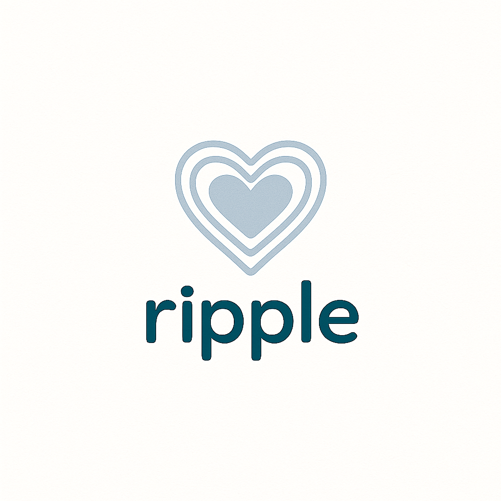
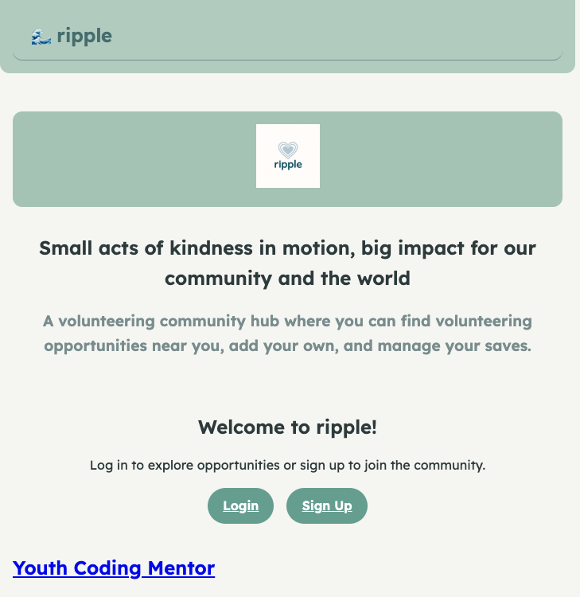
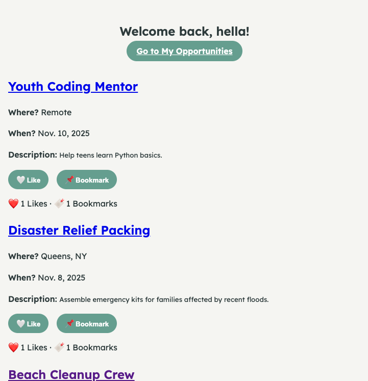
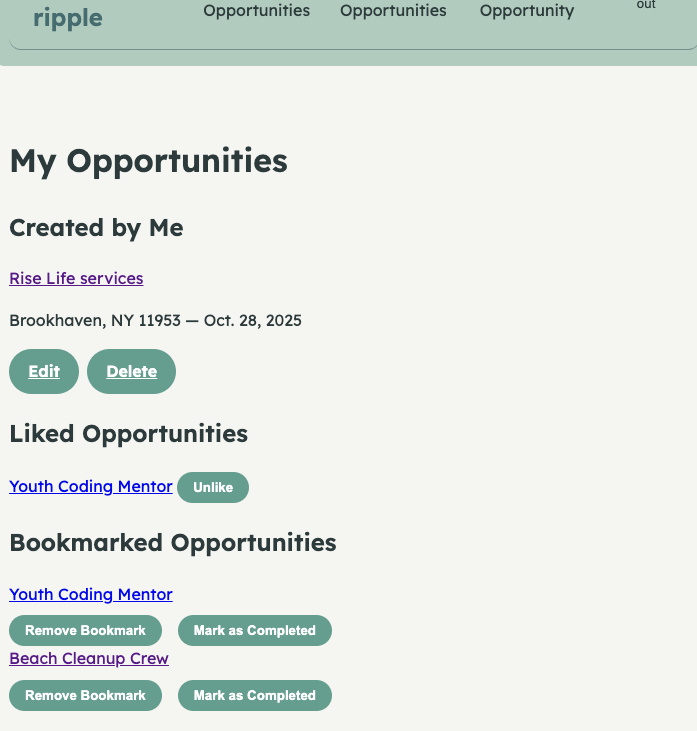
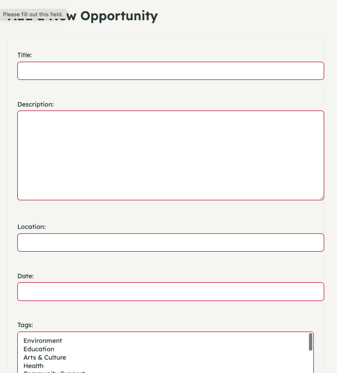

# [ripple](https://ripple-volunteer-381342adbfdc.herokuapp.com/)

Ripple - volunteer is a Django-powered volunteer community platform for discovering, bookmarking, and completing volunteer opportunities.

### Why 
 I always found volunteering to be so much more difficult to do that it should, and people who are willing but new can be lost and discouraged. I also found that community helps, and finding opportunities from like minded people, being able to ask questions and connect with others that created the activity or have completed it, can make for an easier way in. 

### How
 > Planning on [Trello](https://trello.com/b/ZszY6lOO/ripple-volunteer-with-django), User stories for MVP and uture plans, ERD and wireframes. 

### Technologies used

* Backend: Django 5.2.7, 
* Python 3.11
* Frontend: HTML, CSS (modular base.css, scoped form styles)
* Database: SQLite (dev), PostgreSQL (prod-ready)
* Deployment: [Heroku](https://ripple-volunteer-381342adbfdc.herokuapp.com/) 
* Repo: [Github](https://github.com/helenpastras/ripple-volunteer)

### User flow:

> Home/ landing page with publick view of volunteering opprtunities

>Home screen after log-in or sign up with the same opportunities and ability to interact.

>User's own index of opportunities created, liked and bookmarked with edit and delete funictionality.

> Add or Edit an opportunity

